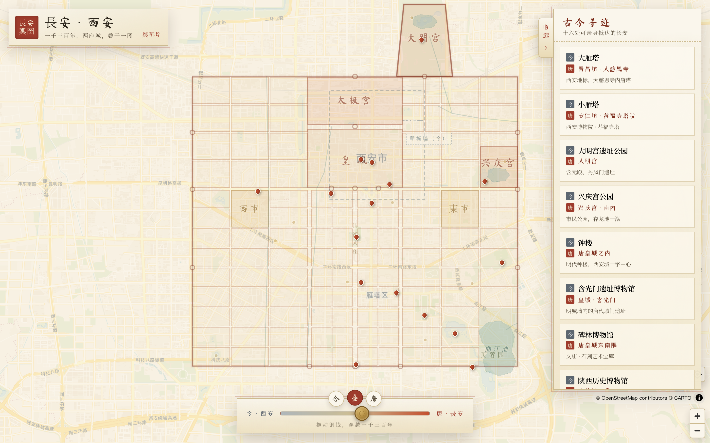
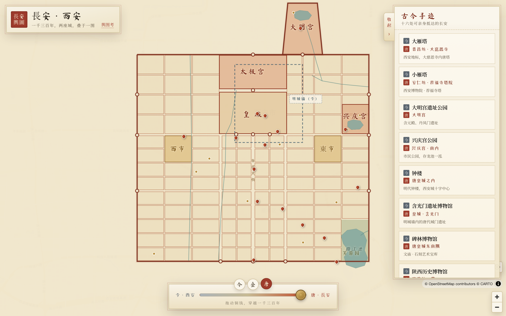
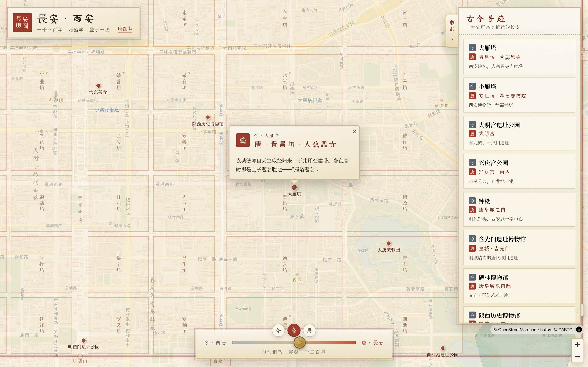

<div align="center">

# 장안 · 시안 — 두 도시의 지도

**당나라의 수도 장안을, 실제 좌표에 맞춰 오늘날의 시안 위에 겹치다.**

개원통보 동전을 끌어 천삼백 년을 오갑니다 —— 오늘의 시안에서 당의 장안으로.

[English](README.md) · [简体中文](README.zh-CN.md) · [繁體中文](README.zh-TW.md) · [日本語](README.ja.md) · 한국어

[](./LICENSE)


</div>

---

영감은 산시성 역사박물관의 한 겹침 지도에서 왔습니다. 위층은 성당(盛唐)의 장안, 아래층은 현대의
시안. 두 겹을 맞대면, 지금 서 있는 이곳이 당나라 때 어느 방(坊)이었는지 알 수 있습니다. 이 프로젝트는
그 발상을 **휴대폰에서 바로 열어 쓸 수 있는** 웹페이지로 만든 것 —— 시안을 찾는 모든 여행자에게.

<div align="center">
  
  <br/><em>겹침 모드 —— 당 장안의 방벽·궁성·동서 시장이 오늘날 시안의 거리 위에 떠오른다</em>
</div>

## ✨ 특징

- **시공 슬라이더**: 개원통보 동전을 손잡이 삼아 「현재」「겹침」「당」 사이를 매끄럽게 이동;
- **탭하면 알 수 있음**: 지도의 어디든 누르면 그곳이 당대에 어느 방(坊)이었는지 표시되며,
  이름난 방에는 일화가 붙습니다(평강방의 환락가, 친인방의 곽자의 저택, 숭업방의 「복숭아 천 그루」… 서른 남짓);
- **고금 탐방**: 오늘날에도 직접 가볼 수 있는 장안 열여섯 곳 —— 대안탑·소안탑·청룡사·대명궁·
  함광문·대당서시…… 각각에 「현재 ↔ 당」 대조 카드;
- **겹겹의 정보층**: 110개 방, 동서 두 시장, 세 대궁, 곡강·부용원, 성안의 운하, 당대에만 있던
  열 곳, 그리고 현재의 기준선이 되는 **명대 성벽 윤곽** —— 오늘날 성벽 안 「구도심」이 당 장안의
  북동쪽 한 귀퉁이에 불과함이 한눈에 보입니다;
- **견본채색의 멋**: 주사·니금·석록에 손글씨 세로쓰기 방 이름. 책상에 펼친 옛 지도처럼.

<div align="center">
  
  
  <br/>
  <em>왼쪽: 당 모드. 점선은 오늘날의 명대 성벽으로, 장안의 북동쪽 한 귀퉁이뿐.&nbsp;&nbsp;오른쪽: 명소의 고금 대조 카드.</em>
</div>

## 🚀 빠른 시작

```bash
npm install
npm run dev        # 개발 서버, 기본 http://localhost:5173
npm run build      # 프로덕션 빌드 → dist/(완전한 정적 파일)
npm run preview    # 프로덕션 빌드를 로컬에서 미리보기
```

## 🛠 기술 스택

| 용도 | 선택 |
| --- | --- |
| 빌드 / 프레임워크 | Vite + React 19 + TypeScript |
| 라우팅 | [TanStack Router](https://tanstack.com/router)（`/` 지도, `/kao` 전거와 주석） |
| 지도 엔진 | [MapLibre GL JS](https://maplibre.org/) |
| 베이스맵 | CARTO Voyager 래스터 타일(OpenStreetMap 기반, WGS84) |
| 당성 레이어 | `src/data/changan.ts`에서 런타임에 생성되는 GeoJSON |

## 🧭 어떻게 「맞췄는가」

당성은 손으로 그린 것이 아니라, 실제 축척과 방위로 **WGS84 좌표에 정합**되었습니다:

- **방 배치**: 송·송민구(宋敏求)『장안지(長安志)』 권7~10을 열 단위로 대조했으며,『당육전(唐六典)』의
  기술과 부합합니다 —— 「황성의 남쪽, 동서 십 방, 남북 구 방. 황성의 동서로 각 십이 방. 두 시장은
  네 방의 땅을 차지하니, 무릇 일백십 방이라.」
- **정합 기준점**(지금도 원위치에 남은 세 당대 유적): **명덕문(明德門)** 터(주작대가 축선과 남벽을
  정함), **함광문(含光門)** 터(황성 남벽), **단봉문(丹鳳門)** 터(북벽 선).
- **자체 검증**: 정합 후 별다른 보정 없이도 대안탑은 진창방에 정확히 들어맞고, 소안탑은 안인방의
  북서쪽 모퉁이, 대흥선사는 정선방의 한가운데, 청룡사는 신창방, 대당서시 박물관은 옛 서시 위 ——
  모두 일치합니다.

> ⚠️ 본 지도는 **개략적 복원**입니다. 방의 경계와 거리는 대략이며 수계는 양식화되어 있습니다.
> **고고학적 전거가 아닙니다.** 전체 출처와 단서는 앱 내 「전거와 주석」(`/kao`)을 참고하세요.

복원 로직 전체는 하나의 파일에 모여 있습니다 —— [`src/data/changan.ts`](src/data/changan.ts).
좌표 보정, 방 추가, 일화 기여는 여기서 시작하세요.

## ☁️ 배포

빌드 산출물은 완전한 정적 파일로, 어떤 정적 호스팅(Cloudflare, Vercel, Netlify, GitHub Pages…)에도
올릴 수 있습니다.

저장소에는 [`wrangler.jsonc`](wrangler.jsonc)가 포함되어 **Cloudflare Workers 정적 자산 + SPA 폴백**으로
설정되어 있습니다:

```bash
npm run deploy     # = npm run build && wrangler deploy
```

기본적으로 `https://changan-map.<당신의-서브도메인>.workers.dev`에 배포되어 바로 쓸 수 있습니다.
자체 도메인을 연결하려면 `wrangler.jsonc`의 주석을 해제하고 해당 줄을 자신의 도메인으로 수정하세요.

## 🌏 중국 본토 사용자 대상 참고 사항

- 베이스맵 타일(`basemaps.cartocdn.com`)과 Google Fonts는 중국 본토에서 접속이 느릴 수 있습니다.
  주 사용자가 본토라면:
  1. 타일을 자체 호스팅하거나 국내에서 접근 가능한 **WGS84** 소스로 교체 —— AMap/Baidu 타일은
     **사용하지 마세요**. 이들은 편이 좌표계(GCJ-02 / BD-09)라 본 지도와 약 300~600m 어긋납니다;
  2. 글꼴(Ma Shan Zheng / ZCOOL XiaoWei / Noto Serif SC)을 `woff2`로 자체 호스팅.

## 📁 프로젝트 구조

```
src/
├── data/changan.ts      # 당성 복원 데이터와 정합 로직(핵심)
├── components/
│   ├── MapView.tsx       # MapLibre 지도: 모든 레이어와 상호작용
│   ├── ControlDock.tsx   # 시공 슬라이더
│   └── PoiPanel.tsx      # 「고금 탐방」 사이드바
├── pages/
│   ├── MapPage.tsx       # 메인 지도 페이지
│   └── KaoPage.tsx       # 전거와 주석
└── index.css            # 견본채색 디자인 시스템
```

## 🤝 기여

Issue와 PR을 환영합니다: 방 이름/좌표 보정, 일화 추가, 베이스맵·글꼴 현지화, 접근성 개선 등.
사료에 근거한 변경은 PR에 출처(문헌과 권차, 또는 고고 보고)를 명기해 주세요.

## 📜 라이선스

코드는 [MIT 라이선스](./LICENSE)로 공개됩니다.

방 이름과 성곽 규모 등의 사료는 『장안지』『당육전』 등 퍼블릭 도메인 문헌에 근거합니다.
베이스맵 데이터 © [OpenStreetMap](https://www.openstreetmap.org/copyright) 기여자, 타일 스타일 © [CARTO](https://carto.com/).

## 🙏 감사의 말

- 송·송민구『장안지』,『당육전』, 그리고 역대 당 장안성의 고고학적 복원 연구;
- [MapLibre](https://maplibre.org/), [CARTO](https://carto.com/), [OpenStreetMap](https://www.openstreetmap.org/) 커뮤니티;
- **산시성 역사박물관**의 당 장안성 겹침 대조 지도에서 영감을 받았습니다.

<div align="center">
<sub>장안은 늘 이곳에 있었다. 다만 이름을 바꿨을 뿐 —— 시안으로.</sub>
</div>
